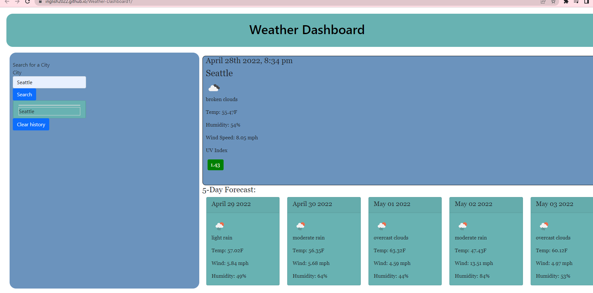

# Weather-Dashboard

## Description

This is a web app using the OpenWeather API. You can search for any city and have the current weather and the 5 day forecast.  It will give you current Temperature, humidity, wind speed and UV index for the day.  Plus temperature, humidity, and wind speed for the next 5 days.I used Jquery, moment.js, and Bootstrap.

## Link

https://github.com/inglish2022/Weather-Dashboard1

## Screenshot

## Authors

Inglish Foust